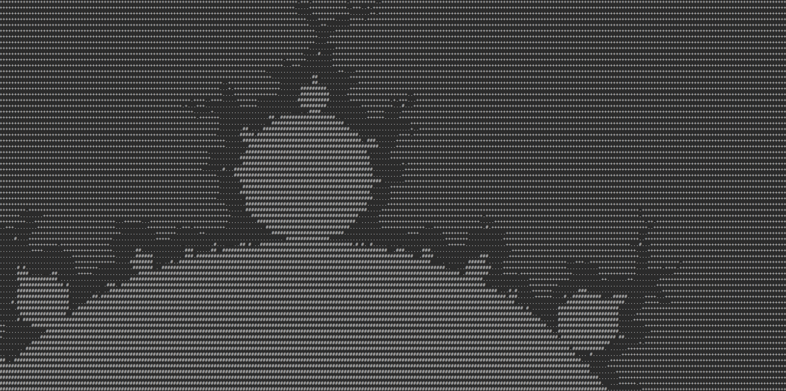

# V Mandelbrot Visualizer

## How to use :
- `./mandelbrot`          : Standard Mandelbrot with ASCII characters for values
- `./mandelbrot -color`   : Colorized versions for colors (Red: Less iterations, Yellow: More Iterations, Black: Most Iterations)

- You can also use your keyboard to move around:
    - Moving `W` `A` `S` `D`
    - Zooming `Q` `E`
    - Adding/Decreasing iterations `I` `K`
    - Exit `CTRL` + `D`